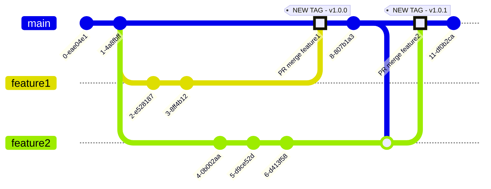

## Introduction

Continuous integration, or CI for short, is the ongoing process of continuously integrating code into the main or active development branch of a Git repository. Usually, each developer works on a piece of code dealing with a specific functionality. In the end, all pieces merge together via the CI process, thus creating the final product.

One typical Git flow is depicted below:



The Git flow used in this guide is a simple one - no release branches, no feature branches, etc. It's just the main branch and release tags. Of course, each developer will work in the end on a feature, fixing a bug, etc, so a dedicated branch gets created. But, in the end everything is merged into the main branch via pull requests. There is a list of reviewers which is automatically assigned, as well as automated workflows to automatically validate or invalidate PRs.

Then, when a certain amount of bug fixes and/or proposed features are merged in, the owner (or the project manager) of the application repository creates a release. This is a separate process and requires manual intervention from designated team members. In the release process, a new version and tag is created (using semantic versioning), as well as the accompanying changelog (or release notes).

GitHub is the most popular solution for collaborative work, sharing open source ideas, and storing application code. It is more than just a frontend for the most reliable source code management tool - [Git](https://git-scm.com/). It also empowers issue tracking, project management, and most important of all - CI automation. GitHub offers [actions](https://docs.github.com/en/actions) and [workflows](https://docs.github.com/en/actions/using-workflows) to help you achieve this goal, hence it's a very good candidate.

In this section, you will learn how to leverage the power of GitHub actions to implement the CI process required by the online boutique sample application.

## Prerequisites

To complete this section you will need:

1. A container registry already set up as explained in the [Getting Started -> Set up DOCR](setup-docr.md) section.
2. A development DOKS cluster set up and running as explained in the [Development Environment -> Set up DOKS](setup-doks-dev.md) section.
3. The `microservices-demo` GitHub repository already prepared as explained in the [Preparing demo application GitHub repository](introduction-and-repository-setup.md) section.
4. Main [branch protection](https://docs.github.com/en/repositories/configuring-branches-and-merges-in-your-repository/defining-the-mergeability-of-pull-requests/about-protected-branches) is enabled and configured for your repository. Also number of reviewers should be set to at least one.
5. Main branch changes should be allowed only via [pull requests](https://docs.github.com/en/repositories/configuring-branches-and-merges-in-your-repository/defining-the-mergeability-of-pull-requests).
6. Your [DigitalOcean authentication token](do-api-auth.md) stored as a GitHub secret named `DIGITALOCEAN_ACCESS_TOKEN` in the `microservices-demo` repository. Follow [this guide](https://docs.github.com/en/actions/security-guides/encrypted-secrets#creating-encrypted-secrets-for-a-repository) to learn more about creating GitHub secrets.

## Online Boutique Application CI Flows Configuration

The CI process used in this guide is comprised of two phases, each with a workflow associated:

1. Developers open a new pull request (or PR for short). Then, automated tests run via a dedicated GitHub workflow, and validate or invalidate the PR. Also, an additional manual review step is required by setting the number of approvals in the [main branch protection rules](https://docs.github.com/en/repositories/configuring-branches-and-merges-in-your-repository/defining-the-mergeability-of-pull-requests/managing-a-branch-protection-rule). A typical pull request flow is depicted below:

    ```mermaid
    graph TD
    A(New PR) --> B(Run Automated Tests)
    B --> C{Tests Passing?}
    C -- No --> D(Reject PR)
    C -- Yes --> E{PR Review Passed?}
    E -- No --> D
    E -- Yes ---> F(Merge PR)
    ```

2. If the PR gets approved and code is merged to main branch, a second workflow runs which builds project assets, pushes them to a registry, and deploys the application to the development environment.

    !!! note
        In practice, it's safe to have automated deployments for the development environment. This way, developers or other team members can see immediate results, and test application behavior on the real environment (besides [remote development with Tilt](tilt-remote.md)).

    A typical main branch flow is depicted below:

    ```mermaid
    graph TD
    A(Close PR) --> B(Merge to Main Branch)
    B --> C(Run Integration Tests)
    C --> D{Tests Passing?}
    D -- No --> E(Reject Build)
    D -- Yes --> F(Build & Tag DEV Images)
    F --> G(Push DEV Images to Registry)
    G --> H(Deploy to DEV Environment)
    ```

Next, you will learn how to implement the CI workflows used in this guide for the [online boutique sample application](https://github.com/digitalocean/kubernetes-sample-apps/tree/master/microservices-demo).

## Configuring Pull Requests Workflow

On each pull request a dedicated workflow is triggered responsible with running automated tests, part of PR validation step. Next, manual review is requested by the developer opening the PR. Reviewers can be assigned also [automatically](https://docs.github.com/en/organizations/organizing-members-into-teams/managing-code-review-settings-for-your-team#about-auto-assignment).

Follow below steps to configure and enable main branch PR validation workflow provided in this guide:

1. Clone the `microservices-demo` repository on your local machine, if not already (make sure to replace the `<>` placeholders accordingly):

    ```shell
    git clone https://github.com/<YOUR_GITHUB_ACCOUNT_USERNAME>/microservices-demo.git
    ```

2. Change directory to your local copy:

    ```shell
    cd microservices-demo
    ```

3. Fetch the CI workflow file from the [kubernetes-sample-apps](https://github.com/digitalocean/kubernetes-sample-apps) repo:

    ```shell
    curl https://raw.githubusercontent.com/digitalocean/kubernetes-sample-apps/master/.github/workflows/online-boutique-pr-ci.yaml \
      -o .github/workflows/online-boutique-pr-ci.yaml \
      --create-dirs
    ```

4. Edit the `.github/workflows/online-boutique-pr-ci.yaml` file using a text editor of your choice, preferably with YAML lint support. For example, you can use [VS Code](https://code.visualstudio.com/):

    ```shell
    code .github/workflows/online-boutique-pr-ci.yaml
    ```

5. Uncomment the lines prefixed with a hash mark at the top of the workflow file. The resulting file should look like:

    ??? note "Click to expand the `Online Boutique PR CI` workflow file"
        ```yaml
        name: Online Boutique PR CI

        on:
          # Used for testing only (can be disabled afterwards)
          workflow_dispatch:
          # Uncomment below lines to enable this workflow on main branch PR events
          pull_request:
            branches:
              - main
            paths-ignore:
              - "**/README.md"
              - "kustomize/**"
              - "argocd/**"
              - ".github/workflows/*"

        # Do not allow concurrent workflows for PRs
        # If disabled, leads to memory exhaustion on the DOKS dev cluster
        concurrency: pr-ci-dev

        # Global environment variables
        env:
          DOCR_ENDPOINT: "registry.digitalocean.com/microservices-demo"
          CLUSTER_NAME: "microservices-demo-dev"
          REGION: "nyc1"
          K8S_NAMESPACE: "microservices-demo-${{ github.event.pull_request.number }}"
          PROJECT_NAME: "online-boutique"

        jobs:
          # Run unit tests in parallel using below matrix to cut down time
          # Unit tests are standalone and should not raise conflicts
          # Each microservice is written in a specific language, hence it's added to the matrix
          unit-tests:
            runs-on: ubuntu-latest
            strategy:
              matrix:
                include:
                  - project_name: cartservice
                    project_language: csharp
                  - project_name: checkoutservice
                    project_language: golang
                  - project_name: currencyservice
                    project_language: javascript
                  - project_name: emailservice
                    project_language: python
                  - project_name: frontend
                    project_language: golang
                  - project_name: paymentservice
                    project_language: javascript
                  - project_name: productcatalogservice
                    project_language: golang
                  - project_name: recommendationservice
                    project_language: python
                  - project_name: shippingservice
                    project_language: golang
            steps:
              - name: Checkout code
                uses: actions/checkout@v3
                with:
                  ref: ${{github.event.pull_request.head.ref}}
                  repository: ${{github.event.pull_request.head.repo.full_name}}

              - name: Set up Go env
                if: ${{ matrix.project_language == 'golang' }}
                uses: actions/setup-go@v3
                with:
                  go-version: "1.19"

              - name: Go Unit Tests
                if: ${{ matrix.project_language == 'golang' }}
                timeout-minutes: 5
                run: |
                  ( 
                    cd src/${{ matrix.project_name }}
                    go test 
                  )

              - name: Set up C# env
                if: ${{ matrix.project_language == 'csharp' }}
                uses: actions/setup-dotnet@v2
                with:
                  dotnet-version: "6.0"
                  include-prerelease: true

              - name: C# Unit Tests
                if: ${{ matrix.project_language == 'csharp' }}
                timeout-minutes: 5
                run: dotnet test src/${{ matrix.project_name }}/

              - name: Set up NodeJS env
                if: ${{ matrix.project_language == 'javascript' }}
                uses: actions/setup-node@v3
                with:
                  node-version: 18

              - name: Javascript Unit Tests
                if: ${{ matrix.project_language == 'javascript' }}
                timeout-minutes: 5
                run: |
                  ( 
                    cd src/${{ matrix.project_name }}
                    npm install
                    npm run test 
                  )

              - name: Set up Python env
                if: ${{ matrix.project_language == 'python' }}
                uses: actions/setup-python@v3
                with:
                  python-version: "3.7"

              - name: Python Unit Tests
                if: ${{ matrix.project_language == 'python' }}
                timeout-minutes: 5
                run: |
                  ( 
                    cd src/${{ matrix.project_name }}
                    pip install -r requirements.txt
                    pytest
                  )

          # Run deployment tests (smoke tests)
          # You can add integration tests as well
          # Please bear in mind that more tests means increased workflow run time
          # With workflow concurrency disabled, means more waiting time for other PRs in the queue
          deployment-tests:
            needs: unit-tests
            runs-on: ubuntu-latest
            steps:
              - name: Checkout code
                uses: actions/checkout@v3
                with:
                  ref: ${{github.event.pull_request.head.ref}}
                  repository: ${{github.event.pull_request.head.repo.full_name}}

              - name: Install doctl
                uses: digitalocean/action-doctl@v2
                with:
                  token: ${{ secrets.DIGITALOCEAN_ACCESS_TOKEN }}

              - name: Log in to DOCR with short-lived credentials
                run: doctl registry login --expiry-seconds 1200

              - name: Set up K8S tools
                uses: yokawasa/action-setup-kube-tools@v0.8.2
                with:
                  kubectl: "1.25.2"
                  kustomize: "4.5.7"
                  tilt: "0.30.9"

              - name: Configure kubectl for DOKS with short-lived credentials
                run: doctl kubernetes cluster kubeconfig save ${{ env.CLUSTER_NAME }} --expiry-seconds 1200

              - name: Deploy microservices to DOKS
                timeout-minutes: 10
                run: |
                  # Bring all microservices up using Tilt and wait for all deployments
                  cp tilt-resources/dev/tilt_config.json .
                  tilt ci -- \
                    --allowed_contexts "do-${{ env.REGION }}-${{ env.CLUSTER_NAME }}" \
                    --default_registry "${{ env.DOCR_ENDPOINT }}" \
                    --environment "dev" \
                    --namespace "${{ env.K8S_NAMESPACE }}"

              - name: Build loadgenerator image
                uses: docker/build-push-action@v3
                with:
                  context: "src/loadgenerator"
                  push: true
                  tags: "${{ env.DOCR_ENDPOINT }}/loadgenerator"

              - name: Smoke tests
                timeout-minutes: 10
                run: |
                  # Prepare load generator
                  # Inject workflow custom docker image
                  sed -i "s#<LOAD_GENERATOR_IMAGE>#${{ env.DOCR_ENDPOINT }}/loadgenerator#g" loadgenerator.yaml

                  # Deploy load generator
                  kubectl apply -f loadgenerator.yaml -n ${{ env.K8S_NAMESPACE }}

                  # Wait for load generator deployment to be ready
                  kubectl wait --for=condition=available --timeout=60s deployment/loadgenerator -n ${{ env.K8S_NAMESPACE }} || {
                    # Show why load generator failed to start
                    echo "[INFO] Load generator pod events"
                    kubectl describe pod -l app=loadgenerator -n ${{ env.K8S_NAMESPACE }} | tail -10
                    exit 1
                  }

                  # Run smoke tests
                  REQUEST_COUNT="0"
                  while [[ "$REQUEST_COUNT"  -lt "50"  ]]; do
                    sleep 5
                    REQUEST_COUNT=$(kubectl logs -l app=loadgenerator -n ${{ env.K8S_NAMESPACE }} | grep Aggregated | awk '{print $2}')
                  done
                  # ensure there are no errors hitting endpoints
                  ERROR_COUNT=$(kubectl logs -l app=loadgenerator -n ${{ env.K8S_NAMESPACE }} | grep Aggregated | awk '{print $3}' | sed "s/[(][^)]*[)]//g")
                  if [[ "$ERROR_COUNT" -gt "0" ]]; then
                    # Print final results
                    echo "[INFO] Load generator results"
                    kubectl logs -l app=loadgenerator -n ${{ env.K8S_NAMESPACE }} | tail -20
                    exit 1
                  fi

                  # Print final results
                  echo "[INFO] Load generator results"
                  kubectl logs -l app=loadgenerator -n ${{ env.K8S_NAMESPACE }} | tail -20
                working-directory: "src/loadgenerator"

              - name: Clean up Tilt microservices environment
                if: ${{ always() }}
                run: |
                  # Remove all microservices and the namespace created by Tilt
                  tilt down --delete-namespaces -- --namespace "${{ env.K8S_NAMESPACE }}"

              - name: Clean up Tilt docker images from registry
                if: ${{ always() }}
                run: |
                  # Remove Tilt docker images from registry
                  for tilt_repo in $(docker images --format "{{.Repository}}:{{.Tag}}" | grep "tilt-.*[a-z|0-9]"); do
                    repo_and_tag="${tilt_repo##*/}"
                    repo="${repo_and_tag%%:*}"
                    tag="${repo_and_tag##*:}"
                    echo "[INFO] Deleting tag $tag from repo $repo ..."
                    doctl registry repository delete-tag "$repo" "$tag" -f
                  done
                  echo "[INFO] Remember to run the DOCR garbage collector from time to time!"
        ```

6. Save the workflow file, commit, and push changes to your git repository `main` branch (**you may need to temporarily disable `main` branch protection first**).

    !!!note
        - Depending on your setup, you may want to adjust the following environment variables at the top of your workflow file:
        ```yaml
        env:
          DOCR_ENDPOINT: "registry.digitalocean.com/<YOUR_REGISTRY_NAME_HERE>"
          CLUSTER_NAME: "<YOUR_DEV_DOKS_CLUSTER_NAME_HERE>"
          REGION: "<YOUR_DEV_DOKS_CLUSTER_REGION_HERE>"
          K8S_NAMESPACE: "<YOUR_PROJECT_CUSTOM_NAMESPACE_HERE>-${{ github.event.pull_request.number }}"
        ```
        - In order to run deployment tests, the example CI workflow provided in this guide creates a dedicated Kubernetes namespace to deploy microservices on your target DOKS development cluster. It is suffixed using the PR number which is unique across PRs. When it finishes, it will try to clean up all associated resources such as the provisioned Kubernetes namespace, and docker images from the registry. For docker registry, you still need to run garbage collection (not triggered automatically in the workflow because it puts the DOCR in read-only mode, hence other PR workflows will fail at the docker clean up step).

Explanation for the above configuration:

- `on.pull_request` - triggers the `Online Boutique PR CI` workflow on pull request events only.
- `on.pull_request.branches` - triggers the `Online Boutique PR CI` workflow whenever a pull request event is detected for the specified list of branches. In this case only `main` branch is desired.
- `on.pull_requests.paths-ignore` - list of repository paths used for filtering. The `Online Boutique PR CI`  workflow is triggered only on paths **not present** in the `paths-ignore` list. Basically, everything is included (microservices as well), except for Kustomize logic, README files, and workflows logic. Kustomize configuration is dealt in a separate workflow, because it's not related to microservices application logic.
- `env` - sets environment variables to use for the whole pipeline. Usually, environment variables control workflow logic.
- `jobs` - defines list of job to run inside the pipeline such as unit tests, deployment tests, etc.
- `strategy.matrix` - use a matrix build type. Runs the unit tests in parallel for each project type combination. This approach is a perfect match for projects using multiple components, such as microservices. It also cuts down the time required to build and test each component. Each element from the matrix sets the project name, and the language being used.
- `steps` - list of steps to execute as part of the workflow jobs. For each project component (or microservice), the following list of actions is executed:
    1. Code checkout, via `actions/checkout@v3`.
    2. Specific tools are installed based on project language (`actions/setup-dotnet@v2`, `actions/setup-go@v3`, etc).
    3. Unit tests are executed for each project.
    4. For deployment tests, the whole suite of microservices is deployed to the DEV environment in a dedicated namespace (unique across PRs) using Tilt. The [dev](https://github.com/digitalocean/kubernetes-sample-apps/tree/master/microservices-demo/tilt-resources/dev) profile is being used.
    5. Then, load tests are performed via the smoke tests step.
    6. Finally, clean up is performed. The microservices setup allocated for the PR is destroyed, including associated Docker images pushed to the registry.

Following diagram shows the `Online Boutique PR CI` workflow composition:


Next, you learn how to configure and enable the main branch workflow that gets triggered whenever changes are pushed to the `main` branch after each PR merge.

## Configuring Main Branch Workflow

Whenever a PR is closed and code is merged into the main branch, a dedicated GitHub workflow is triggered. Main purpose of the main branch workflow is to test the whole application as a whole after merging various features via integration tests. Then, it will build and tag images using latest commit id, push them to registry, and finally deploy everything to the development environment. Usually you want the development environment to continuously reflect the latest changes from the development (or main) branch.

!!! note
    - There's no point to run unit tests again after each PR merge. Unit testing deals with changes for the affected components only. This part it is already taken care in the PR workflow. What makes more sense is to run integration tests as part of the main branch CI flow. This way, you check if application functionality is impacted after merging features in.
    - Adding a [GitHub badge](https://docs.github.com/en/actions/monitoring-and-troubleshooting-workflows/adding-a-workflow-status-badge) in the main project README is another great benefit, giving visual feedback for the latest build state - passing or failing.

Follow below steps to configure and enable the main branch workflow provided in this guide:

1. Clone the `microservices-demo` repository on your local machine, if not already (make sure to replace the `<>` placeholders accordingly):

    ```shell
    git clone https://github.com/<YOUR_GITHUB_ACCOUNT_USERNAME>/microservices-demo.git
    ```

2. Change directory to your local copy:

    ```shell
    cd microservices-demo
    ```

3. Fetch the CI workflow file from the [kubernetes-sample-apps](https://github.com/digitalocean/kubernetes-sample-apps) repo:

    ```shell
    curl https://raw.githubusercontent.com/digitalocean/kubernetes-sample-apps/master/.github/workflows/online-boutique-main-ci.yaml \
      -o .github/workflows/online-boutique-main-ci.yaml \
      --create-dirs
    ```

4. Edit the `.github/workflows/online-boutique-main-ci.yaml` file using a text editor of your choice, preferably with YAML lint support. For example, you can use [VS Code](https://code.visualstudio.com/):

    ```shell
    code .github/workflows/online-boutique-main-ci.yaml
    ```

5. Uncomment the lines prefixed with a hash mark at the top of the workflow file. The resulting file should look like:

    ??? note "Click to expand the `Online Boutique CI Main` workflow file"
        ```yaml
        name: Online Boutique CI Main

        on:
          # Used for testing only (can be disabled afterwards)
          workflow_dispatch:
          # Uncomment below lines to enable this workflow on push to main events
          push:
            branches:
              - main
            paths-ignore:
              - "**/README.md"
              - "kustomize/**"
              - "argocd/**"
              - ".github/workflows/*"

        # Do not allow concurrent workflows
        # Changes should be delivered one a time as code is merged into the main branch
        concurrency: main-ci-dev

        # Global environment variables
        env:
          CI_COMMIT_AUTHOR: "GitHub CI Actions"
          CI_COMMIT_AUTHOR_EMAIL: "gh-ci-actions@noreply.github.com"
          DOCR_ENDPOINT: "registry.digitalocean.com/microservices-demo"
          PROJECT_NAME: "online-boutique"

        jobs:
          # There's no point to run unit tests again after PR merge
          # Unit testing deals with changes for the affected components,
          #   and that it is already taken care in the PR workflow

          # What it makes sense, is to run integration tests,
          #   to see if the whole application is impacted after merging the changes
          #
          # Run deployment tests (integration tests)
          # Please bear in mind that more tests means increased workflow run time
          # With workflow concurrency disabled, means more waiting time for other PRs in the queue
          deployment-tests:
            runs-on: ubuntu-latest
            steps:
              - name: Checkout code
                uses: actions/checkout@v3

              - name: Run integration tests
                run: |
                  echo "[INFO] Not implemented yet!"

          # Build and push project images in parallel using a matrix strategy
          # Cuts down build time
          build-and-push-images:
            needs: deployment-tests
            runs-on: ubuntu-latest
            strategy:
              matrix:
                project:
                  - cartservice
                  - checkoutservice
                  - currencyservice
                  - emailservice
                  - frontend
                  - paymentservice
                  - productcatalogservice
                  - recommendationservice
                  - shippingservice
            steps:
              - name: Checkout code
                uses: actions/checkout@v3

              - name: Install doctl
                uses: digitalocean/action-doctl@v2
                with:
                  token: ${{ secrets.DIGITALOCEAN_ACCESS_TOKEN }}

              - name: Log in to DOCR with short-lived credentials
                run: doctl registry login --expiry-seconds 600

              - name: Build and push image
                uses: docker/build-push-action@v3
                with:
                  # cartservice is an exception - Dockerfile is placed in src/cartservice/src subfolder
                  context: "src/${{ matrix.project }}/${{ matrix.project == 'cartservice' && 'src' || ''}}"
                  push: true
                  tags: "${{ env.DOCR_ENDPOINT }}/${{ matrix.project }}:${{ github.sha }}"

          # Kustomize image field for each microservice present in the `src/` dir
          # Finally, commit changes to main branch and let ArgoCD take over afterwards
          apply-kustomize-changes:
            needs: build-and-push-images
            runs-on: ubuntu-latest
            steps:
              - name: Checkout code
                uses: actions/checkout@v3

              - name: Set up K8S tools
                uses: yokawasa/action-setup-kube-tools@v0.8.2
                with:
                  kustomize: "4.5.7"

              - name: Kustomize dev environment images
                run: |
                  for microservice in src/*/; do
                    microservice="$(basename $microservice)"
                    if [[ "$microservice" == "loadgenerator" ]]; then
                      continue
                    fi
                    (
                      cd kustomize/dev
                      kustomize edit set image $microservice=${{ env.DOCR_ENDPOINT }}/${microservice}:${{ github.sha }}
                    )
                  done

              - name: Commit Kustomize manifests for dev env
                run: |
                  git config --global user.name "${{ env.CI_COMMIT_AUTHOR }}"
                  git config --global user.email "${{ env.CI_COMMIT_AUTHOR_EMAIL }}"
                  git add kustomize/dev/
                  git commit -m "[CI] Bump docker images tag to ${{ github.sha }}"

              - name: Push changes
                uses: ad-m/github-push-action@master
                with:
                  github_token: ${{ secrets.GITHUB_TOKEN }}
        ```

6. Save the workflow file, commit, and push changes to your git repository `main` branch (**you may need to temporarily disable `main` branch protection first**).

    !!!note
        - The `deployment-tests` job from the `Online Boutique CI Main` workflow example contains only a placeholder for integration tests. This part is implementation specific, and it is left for the user to configure.
        - Depending on your setup, you may want to adjust the following environment variables at the top of your workflow file:
          ```yaml
          env:
            CI_COMMIT_AUTHOR: "CI GitHub Actions"
            CI_COMMIT_AUTHOR_EMAIL: "gh-actions@noreply.github.com"
            DOCR_ENDPOINT: "registry.digitalocean.com/<YOUR_REGISTRY_NAME_HERE>"
          ```

Explanation for the above configuration:

- `on.push` - triggers the `Online Boutique Main CI` workflow on push events only.
- `on.push.branches` - triggers the `Online Boutique Main CI` workflow whenever a push event is detected for the specified list of branches. In this case only `main` branch is desired.
- `on.push.paths-ignore` - list of repository paths used for filtering. The `Online Boutique Main CI` workflow is triggered only on paths **not present** in the `paths-ignore` list. Basically, everything is included (microservices as well), except for Kustomize logic, README files, and workflows logic. Kustomize configuration is dealt in a separate workflow, because it's not related to microservices application logic.
- `env` - sets environment variables to use for the whole pipeline. Usually, environment variables control workflow logic.
- `jobs` - defines list of job to run inside the pipeline such as integration tests, build and push docker images, apply Kustomize changes, etc.
- `steps` - list of steps implementing workflow jobs logic.

Following diagram shows the `Online Boutique Main CI` workflow composition:


!!! note
    The final step from above flow chart - `Argo CD Dev Env Sync` is discussed and implemented in the next chapter - [Continous Deployments](setup-continuous-deployments.md).

Next, you learn how to configure and enable the Kustomize manifests validation workflow that gets triggered whenever changes are requested via pull requests affecting the `kustomize/**` path in your GitHub repository.

## Infrastructure Manifests Validation GitHub Workflow

So far you created CI workflows for main application code verification. What about Kubernetes manifests or infrastructure configuration files validation? This guide is using a monorepo structure, hence infrastructure configuration files live in the same repository as application code.

This part is handled via a separate GitHub workflow called `Online Boutique PR Kustomize Validation`. Main role is to perform static checks (or linting) for all Kustomize manifests used in each overlay. It represents an additional step to validate or invalidate pull requests handling infra changes for each environment via Kustomize.

Following diagram shows the `Online Boutique PR Kustomize Validation` workflow logic:


Follow below steps to enable the Kustomize checks workflow for PRs:

1. Clone the `microservices-demo` repository on your local machine, if not already (make sure to replace the `<>` placeholders accordingly):

    ```shell
    git clone https://github.com/<YOUR_GITHUB_ACCOUNT_USERNAME>/microservices-demo.git
    ```

2. Change directory to your local copy:

    ```shell
    cd microservices-demo
    ```

3. Fetch the `online-boutique-pr-kustomize-validation.yaml` workflow file from the [kubernetes-sample-apps](https://github.com/digitalocean/kubernetes-sample-apps) repo:

    ```shell
    curl https://raw.githubusercontent.com/digitalocean/kubernetes-sample-apps/master/.github/workflows/online-boutique-pr-kustomize-validation.yaml \
      -o .github/workflows/online-boutique-pr-kustomize-validation.yaml \
      --create-dirs
    ```

4. Edit the `.github/workflows/online-boutique-pr-kustomize-validation.yaml` file using a text editor of your choice, preferably with YAML lint support. For example, you can use [VS Code](https://code.visualstudio.com/):

    ```shell
    code .github/workflows/online-boutique-pr-kustomize-validation.yaml
    ```

5. Uncomment the lines prefixed with a hash mark at the top of the workflow file. The resulting file should look like:

    ??? note "Click to expand the `Online Boutique PR Kustomize Validation` workflow file"
        ```yaml
        name: Online Boutique PR Kustomize Validation

        on:
          workflow_dispatch:
          pull_request:
            branches:
              - main
            paths:
              - "kustomize/**"

        env:
          KUBECONFORM_VERSION: "0.5.0"
          KUBERNETES_VERSION: "1.24.4"

        jobs:
          job:
            runs-on: ubuntu-latest
            steps:
              - name: Checkout code
                uses: actions/checkout@v3

              - name: Set up kubeconform
                run: |
                  (
                    cd /tmp
                    wget "https://github.com/yannh/kubeconform/releases/download/v${{ env.KUBECONFORM_VERSION }}/kubeconform-linux-amd64.tar.gz"
                    tar xvf kubeconform-linux-amd64.tar.gz
                    chmod u+x ./kubeconform
                  )

              - name: Kustomize linting using kubeconform
                run: |
                  # Test each overlay using kubeconform
                  for kustomize_overlay in kustomize/*/; do
                    kustomize build "$kustomize_overlay" | \
                      /tmp/kubeconform -kubernetes-version "${{env.KUBERNETES_VERSION}}" -summary -verbose
                  done
        ```

6. Save the workflow file, commit, and push changes to your git repository `main` branch (**you may need to temporarily disable `main` branch protection first**).

    !!!note
      Depending on your setup, you may want to adjust the following environment variable at the top of your workflow file:
      ```yaml
      env:
        KUBERNETES_VERSION: "1.24.4"
      ```

Above workflow will validate each Kubernetes manifest using [Kubeconform](https://github.com/yannh/kubeconform/) after rendering via Kustomize. Kubeconform is a tool for validating Kubernetes YAML files using the OpenAPI specifications.

Next, you will test each workflow to check if it meets the required functionality.

## Testing the Online Boutique Application GitHub Workflows

In this section you will test each workflow functionality for each event - pull requests and main branch code merge.

### Testing the Pull Requests Workflow

Follow below steps to test the PR workflow for the online boutique application:

1. Clone the `microservices-demo` repository on your local machine, if not already (make sure to replace the `<>` placeholders accordingly):

    ```shell
    git clone https://github.com/<YOUR_GITHUB_ACCOUNT_USERNAME>/microservices-demo.git
    ```

2. Change directory to your local copy:

    ```shell
    cd microservices-demo
    ```

3. Checkout to a new branch to add a new feature:

    ```shell
    git checkout -b features/musical_instruments
    ```

4. Open the header template file for the frontend microservice using a text editor of your choice, preferably with HTML lint support. For example, you can use [VS Code](https://code.visualstudio.com/):

    ```shell
    code src/frontend/templates/header.html
    ```

5. Change the `Cymbal Shops` string from title section to something different (e.g. `Musical Instruments`):

    ```html
    <title>
        {{ if $.is_cymbal_brand }}
        Musical Instruments
        {{ else }}
        Online Boutique
        {{ end }}
    </title>
    ```

    !!!tip
        You can quickly spin up a local environment using Tilt to test the changes first, as explained in the [local development using Tilt](tilt-local.md) section. You will get live updates for each change which helps in the iterative development process.

6. Save changes, commit and push new branch to remote:

    ```shell
    git commit -am "New feature - musical instruments."
    git push origin features/musical_instruments
    ```

7. Navigate to your GitHub repository page, and open a new pull request against main branch using the `features/musical_instruments` branch as the base.

At this point, the `Online Boutique PR CI` should kick in. Branch merging should be blocked until the workflow finishes successfully, and at least one approval is present (explained in the [prerequisites](#prerequisites) section):


Next, navigate to the `Actions` tab of your GitHub repository and inspect PR workflow progress:


If everything goes as planned, the workflow should pass and the PR can be merged. This is the happy flow. You should also check what happens if introducing a change that breaks things - change one of the unit tests so that it doesn't compile successfully.

Next, you will check the main branch workflow and see if applies required kustomize changes for the development environment.

### Testing the Main Branch Workflow

The second workflow should automatically start after merging code into main branch via the pull request created in the previous step. Navigate to the actions tab of your GitHub repository to see it in action:


!!! note
    Automated deployments to the development environment cluster are disabled for now until configuring continuous deployments via ArgoCD in the next chapter. So, nothing gets deployed yet to the dev environment.

You should also see a new commit added in the Git history of your repo. It shows kustomize changes for each image that was built and tagged using latest PR merge commit id:


### Testing the Infra Manifests GitHub Workflow

This goes the same way as with the previous workflows testing, the only thing that's different is that it triggers only for changes present in the `kustomize/` folder from your GitHub repository. You should be able to test it quickly by changing something in one of the Kustomize overlays of the online boutique project, and then create a new PR. Wait for the validation workflow to star, and check the progress. If everything goes well you should be able to merge the new PR.

!!! tip
    You should also test what happens if you introduce changes breaking Kustomize functionality, such as a misspelled key name in one of the YAML manifests from the `kustomize/` folder. The validation workflow should fail, and the associated PR rejected.

## Additional Best Practices

Going further, you should be able to enhance the CI process even more by following some additional best practices, such as:

1. Run tests only for affected microservices. Should improve workflow run time even more.
2. Strategy matrix used to speed up actions inside the workflow such as running unit tests and building docker images is static. It is possible to create a strategy matrix with dynamic values. For example, the `tilt_config.json` file from the dev profile already contains the list of project microservices, so the matrix can read the values directly from the list.
3. Use [artifacts caching](https://docs.github.com/en/actions/using-workflows/caching-dependencies-to-speed-up-workflows) inside workflows whenever possible.
4. Decouple application code and Kubernetes configuration by using a dedicated Git repository. Application code should not be dependent on Kubernetes configuration, hence it make sense to stay in a different repository. Also, whenever changes are required on the Kubernetes side, you don't need to open PRs and merge Kubernetes specific commits into the application repository.

Next, ArgoCD should pickup the changes and deploy the application automatically to your development environment DOKS cluster. In order for this part to work you need to set it up in the following section.
