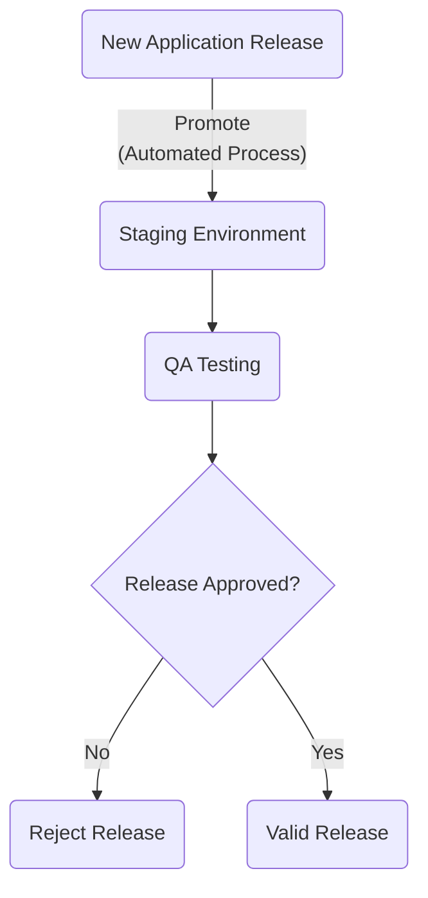
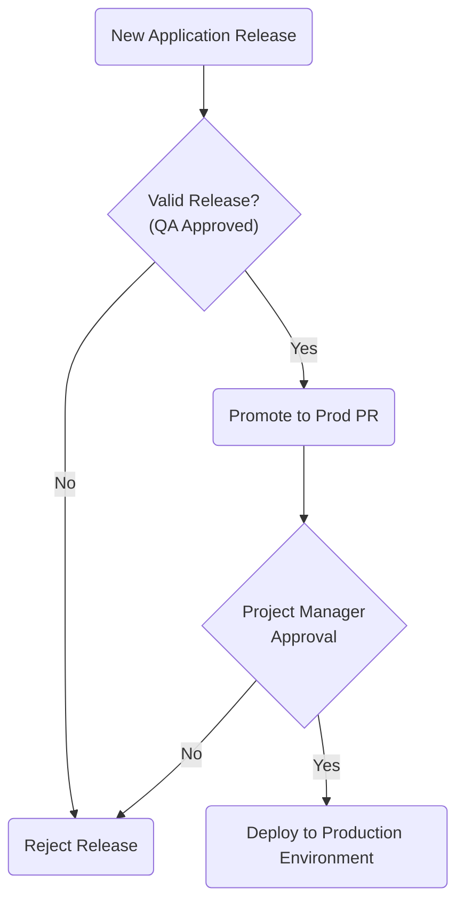

## Introduction

In general, it's not best practice to immediately deploy to production after each new release. You will want to deploy to staging environment first, then have QA team check and approve the release. If everything is ok, then you will move forward and deploy to production.

Promoting a new release to upper environments should happen in a controlled manner via pull requests. This approach ensures atomic changes for each environment. In case something goes wrong, you will revert last PR changes causing issues.

## Promote Releases to Staging Environment

You already have automated deployments enabled for the staging environment from [previous chapter](setup-release-process.md). In other words, releases are automatically promoted to the staging environment.

This approach is safe in general and preferred because the staging environment is used by QA teams testing your product. On the other hand, the same environment is shared with your clients (or customers) so that they can test or preview new features before releasing to production.

Following diagram shows the high level overview of the process:



Once the new release is promoted to staging, the next logical step is for QA team to kick in and test the new release. If everything looks good, then you can move forward to production environment.

## Promote Releases to Production Environment

If new release version received QA approval then the next step is to create a new pull request addressing changes for the production environment. Basically, you will change the `prod` overlay `kustomization.yaml` manifest file to reflect new release version of application images. Optionally (but recommended), a designated team member (usually the project manager) gives the final approval as part of the PR review process.

Following diagram shows the high level overview of the process:



**Prerequisites:**

1. A new version release for your project. You already [released a new version](setup-release-process.md#releasing-a-new-version-for-the-online-boutique-application) for the online boutique application in previous chapter, tagged with `v1.0.1`.
2. Release artifacts already published to DOCR via the designated GitHub workflow. This step is already accomplished for `v1.0.1`, as mentioned above.
3. New application version already tested and approved by QA team for staging environment.

**Steps:**

1. Clone the `microservices-demo` repository on your local machine, if not already (make sure to replace the `<>` placeholders accordingly):

    ```shell
    git clone https://github.com/<YOUR_GITHUB_ACCOUNT_USERNAME>/microservices-demo.git
    ```

2. Change version number in the `images` section of the `kustomize/prod/kustomization.yaml` file from `prod` overlay. For example, if new application version to promote to prod is `v1.0.1`, then the images section looks similar to:

    ```yaml
    ...
    images:
     - name: cartservice
       newName: registry.digitalocean.com/microservices-demo/cartservice
       newTag: v1.0.1
     - name: checkoutservice
       newName: registry.digitalocean.com/microservices-demo/checkoutservice
       newTag: v1.0.1
     - name: currencyservice
       newName: registry.digitalocean.com/microservices-demo/currencyservice
       newTag: v1.0.1
     - name: emailservice
       newName: registry.digitalocean.com/microservices-demo/emailservice
       newTag: v1.0.1
     - name: frontend
       newName: registry.digitalocean.com/microservices-demo/frontend
       newTag: v1.0.1
     - name: paymentservice
       newName: registry.digitalocean.com/microservices-demo/paymentservice
       newTag: v1.0.1
     - name: productcatalogservice
       newName: registry.digitalocean.com/microservices-demo/productcatalogservice
       newTag: v1.0.1
     - name: recommendationservice
       newName: registry.digitalocean.com/microservices-demo/recommendationservice
       newTag: v1.0.1
     - name: shippingservice
       newName: registry.digitalocean.com/microservices-demo/shippingservice
       newTag: v1.0.1
    ...
    ```

    !!! note
        Above example is using **registry.digitalocean.com/microservices-demo** as the DOCR endpoint. Don't forget to adjust according to your setup.

3. Save the `kustomization.yaml` manifest, commit changes to your working branch.
4. Push new branch to remote, and create a new PR addressing Kustomize changes for the `prod` overlay.
5. Next, the [Kustomize validation GitHub workflow](setup-continuous-integration.md#infrastructure-manifests-validation-github-workflow) is automatically triggered.
6. If all checks pass, approve the PR, and merge code to `main` branch.

After a few moments (3 minutes max), ArgoCD picks changes and deploys new application version to `prod` environment. Finally, check if Argo CD synced the new application version to the production environment. After port-forwarding the Argo web console, you should see new application version deployed to your production environment automatically.

## Rollback Bad Releases

A very important aspect of every CD system is the ability to easily rollback an application to a previous working version. On the other hand, you will want to perform the rollback in a timely manner as well to avoid unhappy clients, especially in production environments. Below you will find two methods that you can use. Both should work out of the box and yield the same result, the most notable difference being the speed at which you will perform the actual rollback.

### GitHub PR Revert Feature

In case something goes bad, you should be able to immediately revert the PR causing the culprit for the respective environment. Using PRs ensures atomic changes and rollbacks. Next, Argo CD picks the changes automatically and rolls back to previous application version.

Essentially, you follow the same procedure as explained in the [reverting bad application deployments](setup-continuous-deployments.md#reverting-bad-application-deployments) section from the CD chapter. The big downside of this approach is that it is slower - you have to revert the previous PR, create a new one, wait for validation workflows to pass, manual review, and finally merge changes to main branch.

Next, a faster approach is presented offered by Argo CD itself which suits best for production environments where speed matters.

### Argo CD Application Rollback Feature

Another approach is to use the [Argo CD application rollback](https://argo-cd.readthedocs.io/en/stable/user-guide/commands/argocd_app_rollback/) feature. You should be able to revert to any previous git commit ID. Using this approach you will perform faster application rollbacks.

!!! warning
    Unfortunately there's an [open issue](https://github.com/argoproj/argo-cd/issues/5351) on Argo CD project GitHub repository impeding the rollback feature from working properly. Nevertheless, below steps should give you a quick overview of how this operation is accomplished.

Follow below steps to learn how to use this feature:

1. Make sure kubectl context is set to point to your production environment cluster. Below example is using `do-nyc1-microservices-demo-production` for demonstration - make sure to change value if yours is different:

    ```shell
    kubectl config set-context do-nyc1-microservices-demo-production
    ```

2. Port forward the Argo CD web interface:

    ```shell
    kubectl port-forward -n argocd svc/argocd-server 8080:80
    ```

3. Open the Argo CD dashboard in your web browser using [localhost:8080](https://localhost:8080/).
4. Locate the `argocd/prod-microservices-demo` application tile, and click on it. You will be redirected to the `prod-microservices-demo` application details page.
5. Now, click on the `HISTORY AND ROLLBACK` button located at the top of the page:

    

6. You should see a list of tiles representing deployment history activity for the `prod-microservices-demo` application. You need to scroll down to the second tile from the list, containing the previous release commit ID. Then, click on the three dots button from the right side - a `Rollback` button pops up:

    

7. Click on the `Rollback` button. A dialog box message pops up informing you that the auto-sync feature needs to be turned off in order to finish the rollback operation. This is expected, otherwise Argo will immediately trigger an update if a change is detected in your GitOps repository and undo your rollback operation.
8. Click on the `OK` button, and wait for the process to finish.

Just bear in mind that during the rollback process changes are performed only on the Argo CD server - your Git repository remains untouched. As a consequence, the affected Argo application is not in sync anymore with latest state of your Git repository. This is not a bad thing after all because it gives you time to fix the application. The affected Argo application will be synced again automatically after enabling auto-sync again, and a new release is made containing required fixes.
