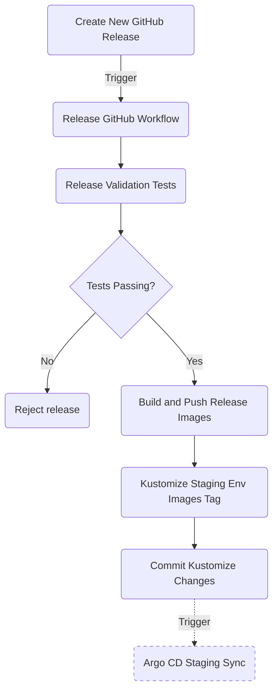

## Introduction

Releasing a new version for a project is a separate process, and it is usually triggered manually by a release engineer (or project owner). GitHub offers the possibility to create and manage releases via the web interface in a very straightforward manner.

GitHub helps you in the release process with creating new tags, generating changelogs, and packing application assets for the specific version. Next, after a new version of the application is released, a dedicated GitHub workflow runs which builds and tags application artifacts. Optionally, trigger a rollout for the new application version in the staging environment.

Depending on your setup (as well as internal policies), the staging environment is set to automatically receive new application versions or not. In general, it's safe to automatically deploy a new release to the staging environment. The staging environment acts as a buffer between the development environment and the final production stage. This environment is used by QA teams to perform additional testing, and in some cases is shared with your customers to check pre-releases or new features before releasing the final product.

!!!note
    This guide enables **automated deployments** for **staging environment** on each release.

## Prerequisites

To complete this section you will need:

1. A container registry already set up as explained in the [Getting Started -> Set up DOCR](setup-docr.md) section.
2. A DOKS cluster set up and running for the [staging environment](setup-doks-staging.md).
3. The `microservices-demo` GitHub repository already prepared as explained in the [Preparing demo application GitHub repository](introduction-and-repository-setup.md) section.
4. Your [DigitalOcean authentication token](do-api-auth.md) stored as a GitHub secret named `DIGITALOCEAN_ACCESS_TOKEN` in the `microservices-demo` repository. Follow [this guide](https://docs.github.com/en/actions/security-guides/encrypted-secrets#creating-encrypted-secrets-for-a-repository) to learn more about creating GitHub secrets.

## Managing Application Releases

The release process is pretty straightforward, and follows below rules:

1. [Semantic versioning](https://semver.org/) is used to distinguish between each release. First version starts at `v1.0.0`.
2. On each release, application version is increased by a `single value`. For example if previous application version was `v1.0.0`, new version will be `v1.0.1`, and so on.
3. A corresponding `git tag` is created on each release. Git tags help you identify changes introduced by a specific version in time. Put it other way, you get a snapshot for a set of application changes in time. Also, in case something goes wrong you should be able to rollback easily to previous application version.
4. A dedicated workflow runs on each git tag event. Main purpose is to build and push project images tagged with the release version. Optionally, it can push new application version to the staging environment.

!!! note
    This guide (and associated examples) uses a simple release process which doesn't cover release candidates, beta releases, hotfixes or other advanced strategies.

Releasing a new version for the online boutique sample application consists of:

1. Create a new GitHub release using the web interface:
    - Tag the new release based on semantic versioning (e.g. v1.0.0).
    - Generate release changelog.
2. Automatically trigger the release GitHub workflow which does the following:
    - Checks the latest release tag and corresponding version.
    - Builds and tags images for application components.
    - Pushes release artifacts to registry (docker images).
3. Optionally, push new release version to staging environment.

The release process flow is depicted below:



Next, you will learn how to configure and enable the GitHub workflow which automatically triggers on each application release.

## Setting Up the Release Process GitHub Workflow

Before jumping to a real world example, the GitHub workflow associated with the release process needs to be configured. The workflow is automatically triggered whenever a new Git tag is created using the following naming convention - **`v[MAJOR].[MINOR].[PATCH]`**.

Follow below steps to perform enable the release workflow:

1. Clone the `microservices-demo` repository on your local machine, if not already (make sure to replace the `<>` placeholders accordingly):

    ```shell
    git clone https://github.com/<YOUR_GITHUB_ACCOUNT_USERNAME>/microservices-demo.git
    ```

2. Change directory to your local copy:

    ```shell
    cd microservices-demo
    ```

3. Fetch the `online-boutique-release.yaml` workflow file from the [kubernetes-sample-apps](https://github.com/digitalocean/kubernetes-sample-apps) repo:

    ```shell
    curl https://raw.githubusercontent.com/digitalocean/kubernetes-sample-apps/master/.github/workflows/online-boutique-release.yaml \
      -o .github/workflows/online-boutique-release.yaml \
      --create-dirs
    ```

4. Edit the `.github/workflows/online-boutique-release.yaml` file using a text editor of your choice, preferably with YAML lint support. For example, you can use [VS Code](https://code.visualstudio.com/):

    ```shell
    code .github/workflows/online-boutique-release.yaml
    ```

5. Uncomment the lines prefixed with a hash mark at the top of the workflow file. The resulting file should look like:

    ??? note "Click to expand the `Online Boutique Release` workflow file"
        ```yaml
        name: Online Boutique Release

        on:
          workflow_dispatch:
          push:
            # Trigger on push events to any tag matching semantic versioning
            tags:
              - 'v[0-9]+\.[0-9]+\.[0-9]+'

        env:
          RELEASE_COMMIT_AUTHOR: "GitHub Release Actions"
          RELEASE_COMMIT_AUTHOR_EMAIL: "gh-release-actions@noreply.github.com"
          DOCR_ENDPOINT: "registry.digitalocean.com/microservices-demo"
          PROJECT_NAME: "online-boutique"

        jobs:
          validation-tests:
            runs-on: ubuntu-latest
            steps:
              - run: echo "[INFO] Not implemented yet!"

          build-and-push-release-images:
            needs: validation-tests
            runs-on: ubuntu-latest
            strategy:
              matrix:
                project:
                  - cartservice
                  - checkoutservice
                  - currencyservice
                  - emailservice
                  - frontend
                  - paymentservice
                  - productcatalogservice
                  - recommendationservice
                  - shippingservice
            steps:
              - name: Checkout code
                uses: actions/checkout@v3

              - name: Install doctl
                uses: digitalocean/action-doctl@v2
                with:
                  token: ${{ secrets.DIGITALOCEAN_ACCESS_TOKEN }}

              - name: Log in to DOCR with short-lived credentials
                run: doctl registry login --expiry-seconds 600

              - name: Build and push image
                uses: docker/build-push-action@v3
                with:
                  # cartservice is an exception - Dockerfile is placed in src/cartservice/src subfolder
                  context: "src/${{ matrix.project }}/${{ matrix.project == 'cartservice' && 'src' || ''}}"
                  push: true
                  tags: "${{ env.DOCR_ENDPOINT }}/${{ matrix.project }}:${{ github.ref_name }}"

          # Kustomize image field for each microservice present in the `src/` dir
          # Finally, commit changes to main branch and let ArgoCD take over afterwards
          apply-kustomize-changes:
            needs: build-and-push-release-images
            runs-on: ubuntu-latest
            steps:
              - name: Checkout code
                uses: actions/checkout@v3

              - name: Set up K8S tools
                uses: yokawasa/action-setup-kube-tools@v0.8.2
                with:
                  kustomize: "4.5.7"

              - name: Kustomize staging environment images
                run: |
                  for microservice in src/*/; do
                    microservice="$(basename $microservice)"
                    if [[ "$microservice" == "loadgenerator" ]]; then
                      continue
                    fi
                    (
                      cd kustomize/staging/
                      kustomize edit set image $microservice=${{ env.DOCR_ENDPOINT }}/${microservice}:${{ github.ref_name }}
                    )
                  done

              - name: Commit Kustomize manifests for staging env
                run: |
                  git config --global user.name "${{ env.RELEASE_COMMIT_AUTHOR }}"
                  git config --global user.email "${{ env.RELEASE_COMMIT_AUTHOR_EMAIL }}"
                  git add kustomize/staging/
                  git commit -m "[Release] Bump docker images tag to ${{ github.ref_name }}"

              - name: Push changes
                uses: ad-m/github-push-action@master
                with:
                  github_token: ${{ secrets.GITHUB_TOKEN }}
        ```

6. Save the workflow file, commit, and push changes to your git repository `main` branch (**you may need to temporarily disable `main` branch protection first**).

    !!!note
        Depending on your setup, you may want to change the following environment variables at the top of your workflow file:
        ```yaml
        env:
          RELEASE_COMMIT_AUTHOR: "GitHub Release Actions"
          RELEASE_COMMIT_AUTHOR_EMAIL: "gh-release-actions@noreply.github.com"
          DOCR_ENDPOINT: "registry.digitalocean.com/<YOUR_REGISTRY_NAME_HERE>"
        ```

Explanation for the above configuration:

- `on.push.tags` - triggers the `Online Boutique Release` workflow whenever a push event is detected for the specified list of tags. In this case only tags matching the following regex expression - `v[0-9]+\.[0-9]+\.[0-9]+` are desired. The regex expression matches any tag name corresponding to the `v[MAJOR].[MINOR].[PATCH]` convention - e.g. `v1.0.0`, `v1.0.1`, and so on.
- `env` - sets environment variables to use for the whole pipeline. Usually, environment variables control workflow logic.
- `jobs` - defines list of job to run inside the pipeline such as validation tests, build and push release docker images, apply Kustomize changes, etc.
- `steps` - list of steps implementing workflow jobs logic.

Next, you will learn how to create a new release version for the online boutique sample application used in this guide.

## Releasing a New Version for the Online Boutique Application

In this section, you will learn how to create a new GitHub release using the web interface. GitHub provides a neat UI experience and helps you create and manage releases for your application using a straightforward process.

!!! tip
    It's best practice to **announce and enforce code freeze** for your repository before each release. This procedure ensures that no changes are pushed to your repository during the release process.

    You can automate this behavior by setting **`pull/triage/push/maintain/admin`** permissions for your GitHub repository via the **REST API**. Bellow snippet allows collaborators to pull code only, thus dissallowing code push to your repository (make sure to replace the `<>` placeholders first):

    === "cURL"

        ```shell
        curl \
          -X PUT \
          -H "Accept: application/vnd.github+json" \
          -H "Authorization: Bearer <YOUR_TOKEN>" \
          https://api.github.com/repos/<OWNER>/<REPO>/collaborators/<USERNAME> \
          -d '{"permission":"pull"}'
        ```

    === "GitHub CLI"

        ```shell
        gh api \
          --method PUT \
          -H "Accept: application/vnd.github+json" \
          /repos/<OWNER>/<REPO>/collaborators/<USERNAME> \
          -f permission='pull'
        ```
    
    Find out more by visiting the [Collaborators REST API](https://docs.github.com/en/rest/collaborators/collaborators/) page from the official GitHub documentation website.

Follow below steps to create and tag a new release for the sample application used in this guide:

1. Prepare a few major changes for the application, open and merge required pull requests to commit all changes to your `microservices-demo` repository.
2. Open a web browser, and navigate to your Github repository hosting the `microservices-demo` sample application.
3. Open the release wizard by clicking the `Create a new release` link on the right side:

    

4. Complete the `Choose a tag` input field using `v1.0.1` for new tag name. Then, click on the `Generate release notes` button, followed by the `Publish release` green button down below:

    

5. Next, the [Release Process GitHub Workflow](#setting-up-the-release-process-github-workflow) configured earlier is triggered. Navigate to the actions tab to see it progressing:

    

If everything goes well, the release process GitHub workflow should finish successfully, and push application images to your DOCR tagged using the `v1.0.1` release version:


Next, a new commit should be present in your microservices-demo repo with the following signature:


Navigate to the respective commit ID, and see what changed - you should see new release version set for all staging env docker images:


Finally, check if Argo CD synced the new application version to the staging environment. After port-forwarding the Argo web console, you should see new application version deployed to your staging environment automatically.

## Reverting a Bad Release

Reverting a bad release goes the same way as you learned in the [Set up continuous deployments -> Reverting bad application deployments](setup-continuous-deployments.md#reverting-bad-application-deployments) chapter.

Next, you will learn how to promote releases to the production environment. This is a step performed manually for obvious reasons, discussed in more detail in the respective chapter.
