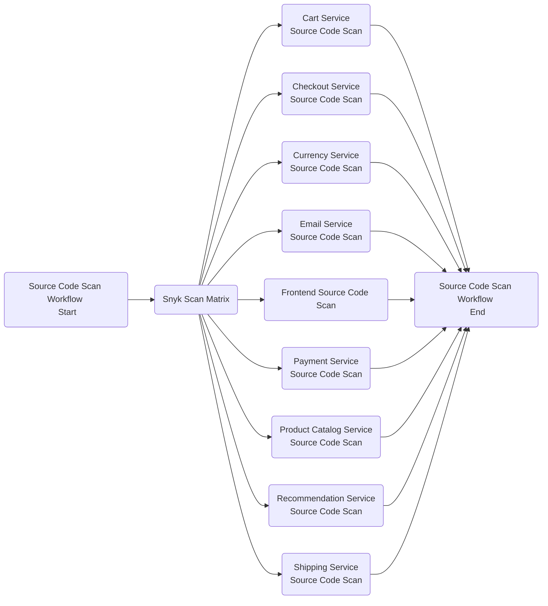
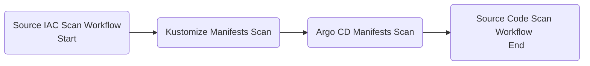
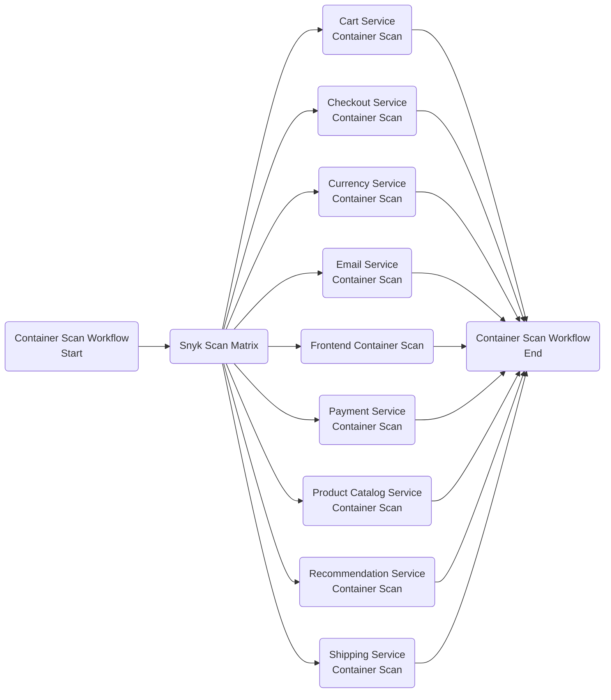

## Introduction

Securing the Kubernetes software supply chain is a challenging task because of the multiple layers and components involved. In the end, it doesn't have to be so. By following a set of best practices and recommendations the process gets easier to implement and manage afterwards.

Below is a set of best practices that will help you achieve a more secure supply chain:

1. Early adoption of security scanning tools right within your IDE. Usually, you get this kind of support via extensions (or plugins) that can be installed right in your preferred IDE. It's best to adopt security best practices in the early stages of development thus preventing breaches at a later time when costs get really high.
2. Use security gates with CI pipelines. Basically, you enable security tools to perform static code analysis for each pull request targeting your GitHub repository.
3. Container registry periodic scans. New vulnerabilities are reported each day so you need to make sure that your registry is scanned on a regular basis and get notified in due time. Even though project images are automatically scanned in the CI process and pass all security checks at that point in time, it doesn't mean they are still safe today. What's important to understand is that any external dependency you source in your project is subject to new threats. Docker base images, 3rd party libraries, etc you fetch and use in your projects add to the list of vulnerabilities.
4. Post-deployment and Kubernetes cluster periodic scans. Same idea as with registry scans. You already deployed application workloads to your cluster but because new vulnerabilities are discovered each day, yet again your system becomes sensible to attacks pretty soon. Enabling continuous scans for Kubernetes workloads (Pods, Deployments, etc), worker nodes, etc, decreases the overall risk. Kubernetes is a multi-tenant system - what if someone bypasses all security checks presented earlier? This is another reason why continuous scanning of your Kubernetes cluster is important.

Because of the multitude of vulnerabilities found each day, this process should be approached systematically. On the other hand, each team or organization decides the level of acceptance considered to be safe for each project internally. Usually, you take care of vulnerabilities reported as high/critical first. Later on, at a fixed interval or even earlier depending on the severity level of newly disclosed vulnerabilities you repeat the process, and so on.

There are several tools available to help you along the way two of the most valuable today being [Kubescape](https://hub.armosec.io/docs/) and [Snyk](https://snyk.io/). In this guide, Snyk is picked because it provides more options and it's more flexible. Either tool you choose the basic idea is the same.

**Why Snyk?**

Snyk provides very good support for the following:

1. IDE integration (e.g. [Visual Studio Code](https://marketplace.visualstudio.com/items?itemName=snyk-security.snyk-vulnerability-scanner)).
2. User application code base scanning.
3. IAC manifests scanning (Kubernetes, Terraform, etc).
4. Third party libraries and open source projects scanning.
5. Application Docker images scanning.
6. Docker registry integration for periodic scanning (including private registries such as [DOCR](https://docs.snyk.io/products/snyk-container/image-scanning-library/digitalocean-image-scanning/container-security-with-digitalocean-integration)).
7. CI pipelines integration via the CLI binary, or [GitHub Actions](https://github.com/snyk/actions).
8. GitHub repository integration for continuous scans of your application repository.
9. Dedicated web portal to investigate reported issues and take appropriate actions to remediate the situation.

All of the above is available in the free version. For small startups and business the [free tier](https://snyk.io/plans/) should be more than enough.

For an in-depth explanations and comparison, please visit DigitalOcean's tutorials dedicated to both [Kubescape and Snyk](https://github.com/digitalocean/container-blueprints/tree/main/DOKS-supply-chain-security). Also, the official documentation for each tool is very valuable and provides more insight.

## Prerequisites

To complete this section you will need:

1. A free [Snyk cloud account](https://app.snyk.io) account used to periodically publish scan results for your Kubernetes cluster to a nice dashboard. Also, the Snyk web interface helps you with investigations and risk analysis. Please follow [How to Create a Snyk Account](https://docs.snyk.io/tutorials/getting-started/snyk-integrations/snyk-account) documentation page.
2. The `microservices-demo` GitHub repository already prepared as explained in the [Preparing demo application GitHub repository](introduction-and-repository-setup.md) section.
3. A [GitHub secret](https://docs.github.com/en/actions/security-guides/encrypted-secrets#creating-encrypted-secrets-for-a-repository) named `SNYK_TOKEN` which holds your Snyk user account ID. Run `snyk config get api` in a terminal to get your ID. If that doesn't work, you should be able to retrieve the token from your [user account settings](https://docs.snyk.io/snyk-web-ui/getting-started-with-the-snyk-web-ui#manage-account-preferences-and-settings) page.
4. The [Snyk Code option enabled](https://docs.snyk.io/products/snyk-code/getting-started-with-snyk-code/activating-snyk-code-using-the-web-ui/step-1-enabling-the-snyk-code-option) in your Snyk Org Setting.
5. A Slack workspace you own, and a dedicated [Slack app](https://api.slack.com/authentication/basics) to get notified of vulnerability scan issues reported by Snyk.

## Configuring Snyk for IDEs

It's very important to discover security issues right from the early stages of development. Integrating vulnerabilities scanning tool with your preferred IDE is a good start. Doing so, you will get security reports right in your IDE for each project you're working on. Fixing security issues in the development stage avoids propagation and later problems in production systems.

### Installing Snyk IDE Extension

This guide is focusing on Visual Studio Code integration because it is the most popular IDE nowadays. Nevertheless, Snyk offers support for other IDEs as well, such as:

1. [Eclipse](https://docs.snyk.io/ide-tools/eclipse-plugin/).
2. [JetBrains](https://docs.snyk.io/ide-tools/jetbrains-plugins/).
3. [Visual Studio](https://docs.snyk.io/ide-tools/visual-studio-extension/).
4. Generic integration via [language server protocol](https://docs.snyk.io/ide-tools/language-server/) for any IDE that supports it.

Follow below steps to integrate Snyk with your existing Visual Studio Code installation:

1. Launch Visual Studio Code, and navigate to the extensions tab:

    

2. Type `snyk` in the search box. Matched extensions should be present:

    

3. Install Snyk extension from the list:

    

After completing above steps, a Snyk button should appear in the left menu bar:


From there you should connect your free Snyk account with Visual Studio Code and benefit from the features offered by the extension. Next, you will discover how easy it is to scan an existing project and get detailed information about reported vulnerabilities.

### Scanning Online Boutique Demo Application

The Snyk extension is able to scan your local projects and report found issues right within your IDE of your choice. This guide is relying on Visual Studio Code but you should get similar experience with other supported IDEs as well.

To test Snyk extension features inside Visual Studio Code, launch the IDE and open your microservices-demo project (should be already cloned on your local machine). Then, follow below steps:

1. Navigate to the Snyk extension menu by clicking the icon from the left menu bar with a dog picture on it.
2. You will be presented with a message asking you to enable Snyk code scanning. This needs to be performed only once for the current project:

    

3. Next, you will be redirected to your Snyk account settings. A new web browser window is opened. Tick the checkbox, and save changes:

    

4. Go back to your VS Code instance - you should see Snyk scanning your project for vulnerabilities. When it finishes, the following report should be presented to you:

    

If everything looks like above then you have successfully scanned your first project using Snyk right from your IDE. Next, click on each reported issue to see the root cause and get additional details:


For each reported issue you should get the severity level printed, and additional explanations why it's considered an issue alongside with a possible fix, if it's known. Severity levels are denoted with an uppercase letter, such as **H** for high severity, **M** for medium severity, and so on.

Please visit the [official documentation](https://docs.snyk.io/ide-tools/visual-studio-code-extension) to learn more about the Snyk IDE extension and all available features.

## Configuring Snyk for CI Pipelines

Snyk offers very good support in terms of CI pipelines automation via the dedicated [CLI](https://docs.snyk.io/snyk-cli/). GitHub pipelines support is also available via [Snyk actions](https://github.com/snyk/actions).

Before going into the implementation steps it's important to understand how Snyk is architected and used in practice. Without going too much into the inner details, you should know the following:

1. Snyk is able to scan your **application code** for vulnerabilities. This feature is provided by the [Snyk Code](https://docs.snyk.io/products/snyk-code/) component.
2. Snyk is able to scan **open source projects** and **3rd party dependencies**. This feature is provided by the [Snyk Open Source](https://docs.snyk.io/products/snyk-open-source/) component.
3. Snyk knows how to scan **Infrastructure as Code** (IAC) manifests such as **Kubernetes**, **Terraform**, etc. This feature is provided by the [Snyk Infrastructure as Code](https://docs.snyk.io/products/snyk-infrastructure-as-code/) component.
4. Snyk knows to scan **containers** (e.g. Docker), as well as **Dockerfiles**. This feature is provided by the [Snyk Container](https://docs.snyk.io/products/snyk-container/) component.

Each feature from the above list is available via the free CLI tool offered by Snyk. This guide is focused more on the CLI integration with GitHub pipelines because of the scripting flexibility that it offers. You already configured a CI pipeline for your project in the [CI chapter](setup-continuous-integration.md) available in the Kubernetes adoption journey guide. Whenever a pull request is opened for your repository, a CI GitHub workflow is automatically triggered for validation.

You will learn how to integrate Snyk with existing CI workflows to benefit from all features offered by the scanning tool. On each scan, the Snyk CLI will generate a report that you can visualize using the web portal offered for free by Snyk. The tool is also able to generate **SARIF** reports hence the final results will be available right in the `Security` tab of your GitHub repository. Other supported formats are **JSON** and **HTML**.

!!! note
    Only the IAC manifests scanner is able to upload results to the Snyk web portal at this time of writing.

Instead of embedding Snyk logic directly into CI pipelines, you will configure **three separate Snyk workflows** running in parallel with existing ones. Each Snyk workflow deals with a specific task such as scanning and detecting vulnerabilities for application source code, IAC manifests, and Docker containers. In the end, the net effect is the same - Snyk acts as a security gate, thus validating or invalidating a pull request based on the scan results.

This approach has the following benefits:

1. Snyk workflows run in parallel with other flows, such as [pull requests CI workflows](setup-continuous-integration.md#configuring-pull-requests-workflow). If you need to fix something that is Snyk related, only the specific workflow is triggered and not the whole PR flow.
2. Waiting time is reduced - some workflows take more time to finish such as PR workflows which runs automated tests.
3. By decoupling Snyk logic, you avoid adding more complexity to the pull requests workflow thus easing maintenance.

Next, you will learn how to configure each Snyk workflow in turn to scan application source code with 3rd party dependencies, IAC manifests and Docker containers.

### Application Source Code Scanning

Snyk uses various heuristics under the hood to perform static analysis of your application source code, as well as 3rd party dependencies. It creates a snapshot for your application source code current state, and runs the analysis. When finished you'll get the scan results printed to standard output in your terminal of choice. Snyk is also able to export scan results in other formats such as **GitHub SARIF**, **JSON**, etc.

Each reported issue has a severity level associated as well such as **critical**, **high**, **medium**, and **low**. Usually you will take into account issues marked as critical and high first. Also, some issues may not affect your application even though they're reported. In such case, you have the option to [exclude or ignore issues](https://docs.snyk.io/snyk-cli/commands/ignore).

**How do you pick the severity threshold?**

Snyk marks your pipeline as failed if the found issues have a severity level **equal to or higher** than the threshold you set. As an example, if you **set the threshold to high**, then Snyk takes into account all issues reported as **high** and **critical**. If the **threshold is set to medium**, then it will take into account all issues reported as **medium**, **high** and **critical**. In other words, if you lower the bar it gets more and more strict.

Follow below steps to configure the Snyk workflow used for application source code scanning:

1. Clone the `microservices-demo` repository on your local machine, if not already (make sure to replace the `<>` placeholders accordingly):

    ```shell
    git clone https://github.com/<YOUR_GITHUB_ACCOUNT_USERNAME>/microservices-demo.git
    ```

2. Change directory to your local copy:

    ```shell
    cd microservices-demo
    ```

3. Fetch the `online-boutique-snyk-source-code-scan.yaml` workflow file from the [kubernetes-sample-apps](https://github.com/digitalocean/kubernetes-sample-apps) repository:

    ```shell
    curl https://raw.githubusercontent.com/digitalocean/kubernetes-sample-apps/master/.github/workflows/online-boutique-snyk-source-code-scan.yaml \
      -o .github/workflows/online-boutique-snyk-source-code-scan.yaml \
      --create-dirs
    ```

4. Edit the `.github/workflows/online-boutique-snyk-source-code-scan.yaml` file using a text editor of your choice, preferably with YAML lint support. For example, you can use [VS Code](https://code.visualstudio.com/):

    ```shell
    code .github/workflows/online-boutique-snyk-source-code-scan.yaml
    ```

5. Uncomment the lines prefixed with a hash mark at the top of the workflow file. The resulting file should look like:

    ??? note "Click to expand the `Online Boutique Snyk Source Code Scan` workflow file"
        ```yaml
        name: Online Boutique Snyk Source Code Scan

        on:
          pull_request:
            branches:
              - main
            paths:
              - "src/**"

          # Below configuration is used for manual workflow dispatch
          workflow_dispatch:
            inputs:
              snyk_fail_threshold:
                description: |
                  Sets fail threshold for Snyk 
                  (low | medium | high | critical)
                required: true
                default: "high"

        env:
          PROJECT_NAME: "online-boutique"
          SNYK_FAIL_THRESHOLD: "high"

        jobs:
          source-code-security-check:
            runs-on: ubuntu-latest
            strategy:
              fail-fast: false
              matrix:
                include:
                  - project_name: cartservice
                    project_language: dotnet
                  - project_name: checkoutservice
                    project_language: golang
                  - project_name: currencyservice
                    project_language: node
                  - project_name: emailservice
                    project_language: python
                  - project_name: frontend
                    project_language: golang
                  - project_name: paymentservice
                    project_language: node
                  - project_name: productcatalogservice
                    project_language: golang
                  - project_name: recommendationservice
                    project_language: python
                  - project_name: shippingservice
                    project_language: golang
            steps:
              - name: Checkout
                uses: actions/checkout@v3
                with:
                  ref: ${{ github.event.pull_request.head.ref }}
                  repository: ${{ github.event.pull_request.head.repo.full_name }}

              - name: Install Snyk
                uses: snyk/actions/setup@master

              - name: Setup dotnet
                if: ${{ matrix.project_language == 'dotnet' }}
                uses: actions/setup-dotnet@v3
                with:
                  dotnet-version: '6.0'

              - name: Restore dotnet project dependencies
                if: ${{ matrix.project_language == 'dotnet' }}
                run: dotnet restore
                working-directory: "src/${{ matrix.project_name }}"
              
              - name: Set up Python env
                if: ${{ matrix.project_language == 'python' }}
                uses: actions/setup-python@v3
                with:
                  python-version: "3.7"
              
              - name: Install Python project dependencies
                if: ${{ matrix.project_language == 'python' }}
                run: pip install -r requirements.txt
                working-directory: "src/${{ matrix.project_name }}"

              - name: Check application source code for vulnerabilities
                run: |
                  # Cartservice is an exception regarding project layout
                  # It uses a nested src subfolder - `src/cartservice/src`
                  if [[ "${{ matrix.project_name }}" == "cartservice" ]]; then
                    cd src/
                  fi
                  snyk code test \
                    --severity-threshold=${{ github.event.inputs.snyk_fail_threshold || env.SNYK_FAIL_THRESHOLD }}
                env:
                  SNYK_TOKEN: ${{ secrets.SNYK_TOKEN }}
                working-directory: "src/${{ matrix.project_name }}"
              
              - name: Check 3rd party source code for vulnerabilities
                run: |
                  # Cartservice is an exception regarding project layout 
                  # It uses a nested src subfolder - `src/cartservice/src`
                  if [[ "${{ matrix.project_name }}" == "cartservice" ]]; then
                    cd src/
                  fi
                  snyk test \
                    --severity-threshold=${{ github.event.inputs.snyk_fail_threshold || env.SNYK_FAIL_THRESHOLD }} \
                    --project-name=${{ env.PROJECT_NAME }} \
                    --target-reference=${{ matrix.project_name }}
                env:
                  SNYK_TOKEN: ${{ secrets.SNYK_TOKEN }}
                working-directory: "src/${{ matrix.project_name }}"
        ```

6. Save the workflow file, commit, and push changes to your GitHub repository.

    !!!note
        Depending on your setup, you may want to adjust the following environment variables at the top of your workflow file:
        ```yaml
        env:
          PROJECT_NAME: "online-boutique"
          SNYK_FAIL_THRESHOLD: "high"
        ```

Explanations for the `Online Boutique Snyk Source Code Scan` workflow configuration:

- `on.pull_request` - triggers the `Online Boutique Snyk Source Code Scan` workflow on pull request events only.
- `on.pull_request.branches` - triggers the `Online Boutique Snyk Source Code Scan` workflow whenever a pull request event is detected for the specified list of branches. In this case only `main` branch is desired.
- `on.pull_requests.paths` - list of repository paths used for filtering. The `Online Boutique Snyk Source Code Scan` workflow is triggered whenever a change happens for the specified paths. It has to trigger whenever a change happens in the `src` folder and below (hence the `src/**` expression), where all microservices source code is stored.
- `env` - sets environment variables to use for the whole pipeline. Usually, environment variables control workflow logic.
- `strategy.matrix` - use a matrix build type. Snyk scans run in parallel for each microservices. This approach is a perfect match for projects using multiple components, such as microservices. It also cuts down the time required to test each component for vulnerabilities. Each element from the matrix sets the project name, and the language being used.
- `steps` - list of steps to execute as part of the workflow jobs. For each project component (or microservice), the following list of actions is executed:
    1. Code checkout, via `actions/checkout@v3`.
    2. Specific tools are installed based on project language (`actions/setup-dotnet@v2`, `actions/setup-python@v3`, etc). Snyk requires extra steps for **Python** and **DotNET** projects such as installing required dependencies before starting the actual scan.
    3. Application source code and 3rd party dependencies are scanned via `snyk code test` and `snyk test` commands.
    4. The severity threshold is picked either from the designated workflow environment variable, or from the designated input field if it is manually triggered. The manual trigger option is left as an alternative for testing the workflow - it is not triggered under normal circumstances.

!!! note
    The `Online Boutique Snyk Source Code Scan` GitHub workflow matrix strategy has the `fail-fast` flag set to `false`. This is desired in this case because you will want to scan all microservices and wait for the final results to fix all issues, if any.

Following diagram shows a high level overview of `Online Boutique Snyk Source Code Scan` workflow composition:



Next, you will configure the Snyk GitHub workflow that automatically triggers whenever a change is detected for Kustomize manifests, aka trigger IAC scans.

### IAC Manifests Scanning

Besides application source code you will also have configuration data present in your repository if using a monorepo structure. Configuration data usually represents Kubernetes manifests, Terraform HCL files, etc. Adoption journey guide deals with Kustomize manifests defining Kubernetes manifests for each environment where the online boutique application runs.

Kustomize and associated Kubernetes manifests are part of the supply chain as well hence it makes sense to create a dedicated workflow to keep an eye on this part. Argo CD generated manifests from the [CD chapter](setup-continuous-deployments.md) is also part of the supply chain so it's best practice to include it as well in the automated scan process (already done via the GitHub workflow presented below).

Follow below steps to configure the Snyk workflow used for IAC manifests scanning (Kustomize + Argo CD):

1. Clone the `microservices-demo` repository on your local machine, if not already (make sure to replace the `<>` placeholders accordingly):

    ```shell
    git clone https://github.com/<YOUR_GITHUB_ACCOUNT_USERNAME>/microservices-demo.git
    ```

2. Change directory to your local copy:

    ```shell
    cd microservices-demo
    ```

3. Fetch the `online-boutique-snyk-iac-scan.yaml` workflow file from the [kubernetes-sample-apps](https://github.com/digitalocean/kubernetes-sample-apps) repository:

    ```shell
    curl https://raw.githubusercontent.com/digitalocean/kubernetes-sample-apps/master/.github/workflows/online-boutique-snyk-iac-scan.yaml \
      -o .github/workflows/online-boutique-snyk-iac-scan.yaml \
      --create-dirs
    ```

4. Edit the `.github/workflows/online-boutique-snyk-iac-scan.yaml` file using a text editor of your choice, preferably with YAML lint support. For example, you can use [VS Code](https://code.visualstudio.com/):

    ```shell
    code .github/workflows/online-boutique-snyk-iac-scan.yaml
    ```

5. Uncomment the lines prefixed with a hash mark at the top of the workflow file. The resulting file should look like:

    ??? note "Click to expand the `Online Boutique Snyk IAC Scan` workflow file"
        ```yaml
        name: Online Boutique Snyk IAC Scan

        on:
          pull_request:
            branches:
              - main
            paths:
              - "argocd/**"
              - "kustomize/**"

          # Below configuration is used for manual workflow dispatch
          workflow_dispatch:
            inputs:
              snyk_fail_threshold:
                description: |
                  Sets fail threshold for Snyk 
                  (low | medium | high | critical)
                required: true
                default: "high"

        env:
          PROJECT_NAME: "online-boutique"
          SNYK_FAIL_THRESHOLD: "high"

        jobs:
          iac-security-check:
            runs-on: ubuntu-latest
            steps:
              - name: Checkout
                uses: actions/checkout@v3
                with:
                  ref: ${{ github.event.pull_request.head.ref }}
                  repository: ${{ github.event.pull_request.head.repo.full_name }}

              - name: Install Snyk
                uses: snyk/actions/setup@master

              - name: Check for Kubernetes manifests vulnerabilities
                run: |
                  snyk iac test \
                    --severity-threshold=${{ github.event.inputs.snyk_fail_threshold || env.SNYK_FAIL_THRESHOLD }} \
                    --target-name=${{ env.PROJECT_NAME }} \
                    --target-reference="kustomize-PR#${{ github.event.pull_request.number }}" \
                    --report
                env:
                  SNYK_TOKEN: ${{ secrets.SNYK_TOKEN }}
                working-directory: kustomize

              - name: Check for Argo CD manifests vulnerabilities
                run: |
                  snyk iac test \
                    --severity-threshold=${{ github.event.inputs.snyk_fail_threshold || env.SNYK_FAIL_THRESHOLD }} \
                    --target-name=${{ env.PROJECT_NAME }} \
                    --target-reference="argocd-PR#${{ github.event.pull_request.number }}" \
                    --report
                env:
                  SNYK_TOKEN: ${{ secrets.SNYK_TOKEN }}
                working-directory: argocd
        ```

6. Save the workflow file, commit, and push changes to your GitHub repository.

    !!!note
        Depending on your setup, you may want to adjust the following environment variables at the top of your workflow file:
        ```yaml
        env:
          PROJECT_NAME: "online-boutique"
          SNYK_FAIL_THRESHOLD: "high"
        ```

Explanations for the `Online Boutique Snyk IAC Scan` workflow configuration:

- `on.pull_request` - triggers the `Online Boutique Snyk IAC Scan` workflow on pull request events only.
- `on.pull_request.branches` - triggers the `Online Boutique Snyk IAC Scan` workflow whenever a pull request event is detected for the specified list of branches. In this case only `main` branch is desired.
- `on.pull_requests.paths` - list of repository paths used for filtering. The `Online Boutique Snyk IAC Scan` workflow is triggered whenever a change happens for the specified paths. It has to trigger whenever a change happens in the `kustomize` folder and below (hence the `kustomize/**` expression), or for `argocd` folder in the same manner.
- `env` - sets environment variables to use for the whole pipeline. Usually, environment variables control workflow logic.
- `steps` - list of steps to execute as part of the workflow jobs. The following list of actions is executed:
    1. Code checkout, via `actions/checkout@v3`.
    2. Kustomize and Argo CD source manifests are scanned via `snyk iac test` command.
    3. The severity threshold is picked either from the designated workflow environment variable, or from the designated input field if it is manually triggered. The manual trigger option is left as an alternative for testing the workflow - it is not triggered under normal circumstances.
    4. You also have the possibility to upload scan result reports to the Snyk web portal via the `--report` flag, but it is not mandatory. Above workkflow has this feature enabled because it helps to identify issues better. Please bear in mind that this feature is available only for IAC scans at this time of writing.

Following diagram shows a high level overview of `Online Boutique Snyk IAC Scan` workflow composition:



Next, you will configure the Snyk GitHub workflow that deals with scanning and detecting vulnerabilities for application Docker containers.

### Docker Containers Scanning

The final piece from the supply chain security covered in this guide is related to application containers scanning. Docker is the most popular solution used today so it makes sense to cover this part as well.

Follow below steps to configure the Snyk workflow used for application Docker containers scanning (including `Dockerfiles`):

1. Clone the `microservices-demo` repository on your local machine, if not already (make sure to replace the `<>` placeholders accordingly):

    ```shell
    git clone https://github.com/<YOUR_GITHUB_ACCOUNT_USERNAME>/microservices-demo.git
    ```

2. Change directory to your local copy:

    ```shell
    cd microservices-demo
    ```

3. Fetch the `online-boutique-snyk-docker-scan.yaml` workflow file from the [kubernetes-sample-apps](https://github.com/digitalocean/kubernetes-sample-apps) repository:

    ```shell
    curl https://raw.githubusercontent.com/digitalocean/kubernetes-sample-apps/master/.github/workflows/online-boutique-snyk-docker-scan.yaml \
      -o .github/workflows/online-boutique-snyk-docker-scan.yaml \
      --create-dirs
    ```

4. Edit the `.github/workflows/online-boutique-snyk-docker-scan.yaml` file using a text editor of your choice, preferably with YAML lint support. For example, you can use [VS Code](https://code.visualstudio.com/):

    ```shell
    code .github/workflows/online-boutique-snyk-docker-scan.yaml
    ```

5. Uncomment the lines prefixed with a hash mark at the top of the workflow file. The resulting file should look like:

    ??? note "Click to expand the `Online Boutique Snyk Docker Scan` workflow file"
        ```yaml
        name: Online Boutique Snyk Docker Scan

        on:
          pull_request:
            branches:
              - main
            paths:
              - "src/**/Dockerfile"

          # Below configuration is used for manual workflow dispatch
          workflow_dispatch:
            inputs:
              snyk_fail_threshold:
                description: |
                  Sets fail threshold for Snyk 
                  (low | medium | high | critical)
                required: true
                default: "high"

        env:
          DOCR_ENDPOINT: "registry.digitalocean.com/microservices-demo"
          PROJECT_NAME: "online-boutique"
          SNYK_FAIL_THRESHOLD: "high"

        jobs:
          container-security-check:
            runs-on: ubuntu-latest
            strategy:
              fail-fast: false
              matrix:
                project:
                  - cartservice
                  - checkoutservice
                  - currencyservice
                  - emailservice
                  - frontend
                  - paymentservice
                  - productcatalogservice
                  - recommendationservice
                  - shippingservice
            steps:
              - name: Checkout
                uses: actions/checkout@v3
                with:
                  ref: ${{ github.event.pull_request.head.ref }}
                  repository: ${{ github.event.pull_request.head.repo.full_name }}

              - name: Install Snyk
                uses: snyk/actions/setup@master

              - name: Build app image for Snyk container scanning
                uses: docker/build-push-action@v3
                with:
                  # Cartservice is an exception - Dockerfile is placed in `src/cartservice/src` subfolder
                  context: "src/${{ matrix.project }}/${{ matrix.project == 'cartservice' && 'src' || ''}}"
                  push: false
                  tags: "${{ env.DOCR_ENDPOINT }}/${{ matrix.project }}:${{ github.event.pull_request.head.sha }}"

              - name: Check application container vulnerabilities
                run: |
                  # Cartservice is an exception regarding project layout
                  # It uses a nested src subfolder - `src/cartservice/src`
                  if [[ "${{ matrix.project }}" == "cartservice" ]]; then
                    cd src/
                  fi
                  snyk container test "${{ env.DOCR_ENDPOINT }}/${{ matrix.project }}:${{ github.event.pull_request.head.sha }}" \
                    --file=Dockerfile \
                    --severity-threshold=${{ github.event.inputs.snyk_fail_threshold || env.SNYK_FAIL_THRESHOLD }} \
                    --target-name=${{ env.PROJECT_NAME }} \
                    --target-reference=${{ matrix.project }}
                env:
                  SNYK_TOKEN: ${{ secrets.SNYK_TOKEN }}
                working-directory: "src/${{ matrix.project }}"
        ```

6. Save the workflow file, commit, and push changes to your GitHub repository.

    !!!note
        Depending on your setup, you may want to adjust the following environment variables at the top of your workflow file:
        ```yaml
        env:
          DOCR_ENDPOINT: "registry.digitalocean.com/<YOUR_REGISTRY_NAME_HERE>"
          PROJECT_NAME: "online-boutique"
          SNYK_FAIL_THRESHOLD: "high"
        ```

Explanations for the `Online Boutique Snyk Docker Scan` workflow configuration:

- `on.pull_request` - triggers the `Online Boutique Snyk Docker Scan` workflow on pull request events only.
- `on.pull_request.branches` - triggers the `Online Boutique Snyk Docker Scan` workflow whenever a pull request event is detected for the specified list of branches. In this case only `main` branch is desired.
- `on.pull_requests.paths` - list of repository paths used for filtering. The `Online Boutique Snyk Docker Scan` workflow is triggered whenever a change happens for the specified paths. It has to trigger whenever a change happens in the `Dockerfile` of each microservice from the `src` folder (hence the `src/**/Dockerfile` expression).
- `env` - sets environment variables to use for the whole pipeline. Usually, environment variables control workflow logic.
- `steps` - list of steps to execute as part of the workflow jobs. The following list of actions is executed:
    1. Code checkout, via `actions/checkout@v3`.
    2. Each microservice container is built and scanned used `snyk container test` command. The container scan process uses each microservice `Dockerfile` as a reference.
    3. The severity threshold is picked either from the designated workflow environment variable, or from the designated input field if it is manually triggered. The manual trigger option is left as an alternative for testing the workflow - it is not triggered under normal circumstances.

Following diagram shows a high level overview of `Online Boutique Snyk Docker Scan` workflow composition:



Next, you will discover how to benefit from the Snyk workflows created so far, and then how to investigate and fix some of the reported security issues.

## Testing the Final Setup

To test each Snyk workflow a few PRs are required first, each dealing with a specific area of interest. As seen in previous sections, each Snyk workflow is responsible with scanning a specific area of the Kubernetes supply chain:

1. Application source code and 3rd party artifacts (such as external libraries).
2. Kubernetes manifests (Kustomize and Argo CD).
3. Docker containers and associated Dockerfiles.

Next, each area of interest is touched briefly with the accompanying examples and explanations.

### Inspecting and Fixing Application Source Code Vulnerabilities

Testing the Snyk workflow responsible with detecting application source code vulnerabilities implies the following:

1. Create a PR addressing source code changes for one (or multiple) application components. For example, change some of the header of footer HTML templates from the frontend component.
2. Verify PR checks window - should show both main PR and Snyk application source code scan workflows running in parallel:

    

3. Watch closely the Snyk application source code scan workflow as it progresses:

    

After the Snyk application source code scan workflow finishes you should see if and how each microservice is affected. Below example shows the list of issues reported for the frontend microservice:


You will receive some explanations and hints regarding the line of code that imposes a security risk, as well as why it is considered an issue and a possible fix (if it is known). Next, it is the responsibility of the developer to consult with the team and management, and decide if the highlighted issue o(r set of issues) is really a threat. There are situations when it's safe to [ignore some of the reported issues](https://support.snyk.io/hc/en-us/articles/360000923498-How-can-I-ignore-a-vulnerability-) and add them to the exceptions list.

After a decision was made, you either mark the issue(s) as an exception, or proceed and create a set of fixes for the current PR. Push changes, and if everything goes well the workflow checks should pass.

!!! tip
    To avoid many iterations and thus reducing wait time for each PR, you should benefit from the IDE integration that Snyk offers. This is the first and most important best practice explained in this chapter.

### Inspecting and Fixing IAC Vulnerabilities

The process of inspecting and fixing IAC manifests is similar to previous section except that in this case only Kubernetes manifests are scanned. Whenever you open a PR containing changes for the `kustomize` and/or `argocd` subfolder, the Snyk IAC scan workflow is automatically triggered.

You also get a report in the Snyk web portal that looks like below (after navigating to the projects page):


In the above example only a low severity issue is reported. Nevertheless, after expanding `kustomize-PR#<YOUR_PR_NUMBER>` reports, click on the `base/redis.yaml` manifest. You should see the following low severity issue reported:


### Inspecting and Fixing Docker Containers Vulnerabilities

Whenever a PR is created containing changes for each microservice Dockerfile, then the associated `Online Boutique Snyk Docker Scan` workflow is triggered. Below is a sample screenshot about how it looks in practice:


By clicking on one of the scans, you will get additional details about discovered issues:


The process of addressing Docker issues goes the same way as with the previously discussed ones.

## Configuring Snyk for Docker Registry Scanning

Snyk also offers support for various integrations such as DigitalOcean Container Registry, aka DOCR. Integrating your DOCR with Snyk offers the possibility to continuously monitor and get notified about newly disclosed vulnerabilities for each container you use to deploy your applications.

This is different from continuously scanning and validating project artifacts on each pull request. The pull request is validated and it's approved at a specific point in time, but this doesn't mean the deployed artifacts are still safe in the near future.

Follow below steps to enable this feature:

1. Log in to your Snyk portal, and navigate to the `Integrations` menu from the left. Scroll down the page untill you see the `Container registries` section:

    

2. Click on the `DigitalOcean` tile. In the next page, enter your DO API token, and hit save.
3. Finally, select your project images you want to monitor continuously via Snyk:

    

After clicking the `Add Selected Images` button at the top you should be ready to go. From now on you will receive periodic emails informing you about newly disclosed vulnerabilities for the selected application containers.

## Continuous Monitoring of Applications

Just as with Docker, Snyk offers another feature for continuously monitoring your applications before each deployment. The Snyk CLI offers this feature via the `snyk monitor` command. It uploads a snapshot of your app to the Snyk portal. Then, whenever a new vulnerability is disclosed, you will get notified via email.

This approach has a major benefit over existing PR checks because new vulnerabilities are disclosed periodically, so you will be always up to date with your project.

You will find more information about this feature [here](https://docs.snyk.io/integrations/ci-cd-integrations/snyk-ci-cd-integration-deployment-and-strategies/snyk-test-and-snyk-monitor-in-ci-cd-integration).

## Configuring Slack Notifications

You can set up Snyk to send Slack alerts about new vulnerabilities discovered in your projects, and about new upgrades or patches that have become available.

To set it up, you will need to generate a Slack webhook. You can either do this via [Incoming WebHooks](https://api.slack.com/messaging/webhooks) or by creating your own [Slack App](https://api.slack.com/start/building). Once you have generated your Slack Webhook URL, go to your `Manage organization` settings, enter the URL, and click the `Connect` button:


## Additional Best Practices and Resources

Although the workflows presented in this guide should give you a good starting point, they may be not so perfect. For example, when working on microservices based projects, each developer works on microservice or on a set of microservices. The workflows presented in this chapter don't have builtin logic to deal with scanning only microservices that actually change between each iteration for the main project. The Snyk workflows presented here trigger and scan all the microservices at once each time. If the company or the team behind the main project decides to allocate a developer per microservice then it makes sense to isolate and trigger each Snyk scan per microservice based on which one has changed.

There are two possible ways of achieving this:

1. Leave the Snyk application source code scan workflow as is and use a GitHub action that detects which files changed from the `src` folder. Then, for each job in the matrix representing each microservice, add a condition to skip it or not based on the set of files that changed.
2. Split the Snyk workflow in multiple workflows for each microservice. Then, filter using the `paths` field from the `on.pull_request` event trigger.

Learn more by reading the following additional resources:

- [DigitalOcean Supply Chain Security Guides](https://github.com/digitalocean/container-blueprints/tree/main/DOKS-supply-chain-security)
- [Kubernetes Security Best Practices Article from Snyk](https://snyk.io/learn/kubernetes-security/)
- [More about Snyk Security Levels](https://docs.snyk.io/introducing-snyk/snyks-core-concepts/severity-levels)
- [Vulnerability Assessment](https://snyk.io/learn/vulnerability-assessment/)
- [Snyk Targets and Projects](https://docs.snyk.io/introducing-snyk/introduction-to-snyk-projects)
- [Snyk for IDEs](https://docs.snyk.io/ide-tools)
- [Discover more Snyk Integrations](https://docs.snyk.io/integrations)
- [Snyk Portal Users and Group Management](https://docs.snyk.io/features/user-and-group-management)
- [Fixing and Prioritizing Issues Reported by Snyk](https://docs.snyk.io/features/fixing-and-prioritizing-issues)
- [Snyk Github Action Used in this Guide](https://github.com/snyk/actions)
